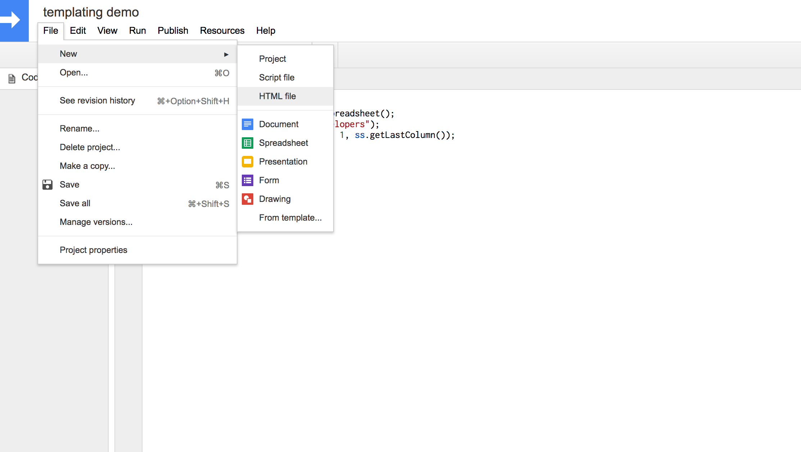

# Learning html templating with Google Apps Script

This readme explores how to visualise data from a Google Sheets Spreadsheet in a web app that can be run in the browser.

The idea for this was borne out the need for a better visual tool for viewing and comparing data from applicants to the Founders & Coders bootcamp. Since a Google Form is used for the application itself, it seemed best to continue to use Google products for the process of reviewing and selecting candidates.

For my demo I use a more generic example of comparing applicants for a developer role.

This readme assumes basic working knowledge of web development and of Google Sheets. Google Apps Script is a very powerful tool, and so this is a quick introduction to html templates for beginners.


## Quick intro to writing scripts for Google Sheets

This is a very quick explanation for people with 0 knowledge of Google Apps Script.

Like macros in MS Excel, Google Apps Script (GAS) allows you to write scripts with which you can read, edit and manipulate your own spreadsheets. You can also do lots of other things with it, like read files from your Google Drive or send emails from your Gmail account.

GAS is Javascript based and - if you're already familiar with Javascript - pretty easy to learn. The syntax for interacting with your spreadsheet is similar to that for interacting with the DOM in vanilla Javascript.

However, unlike regular client side JS, GAS is run server-side, i.e. on Google's servers. It can therefore be a lot slower than what we're used to with the browser.

Here's an example of how to get data about the first developer in my table of developer applications:

```js
function getFirstApplicant() {
  var ss = SpreadsheetApp.getActiveSpreadsheet(); // you need this to start!
  var sheet = ss.getSheetByName("developers");  // the sheet I'm working on
  var firstRow = sheet.getRange(2, 1, 1, ss.getLastColumn()); // the range I'm working with : 2nd row, 1st column, 1 row, all columns with data in
  return firstRow.getValues()[0] //.getValues() returns a 2D array of data from the table, of which we want just the first subarray, i.e. row;
}

Logger.log(getFirstApplicant()); // in GAS you have a Logger instead of a console!
 // logs: [Emily, emilyb7, Developer, Javascript]
```

For a much more detailed explanation of any of the above concepts, I'd recommend checking out [Google's own documentation](https://developers.google.com/apps-script/reference/spreadsheet/).


## Introducing html templates

Html templates allow us to extend the potential of GAS and turn it in to a client-side web application that runs in the user's browser.

The main use case here is for extensions or apps that users can install and use in combination with other Google web apps like Google Sheets itself. It can also be used to create html email templates and to send them out via Gmail.

In this case, however, we're making a standalone web app which we can deploy either for private or public use and which will be hosted by Google.

To create an html template, go to 'file' >> 'new' in the Google Script Editor and select 'HTML file' from the menu.



Your new html file should have some html pre-loaded into it. You can add regular html, css and javascript to this, just as you would if you were writing code for the browser. As far as I can tell, all the regular functionality - like manipulating DOM elements and logging to the browser console - are available to us.

You can use your web app to interact with the data in your spreadsheet in two ways:

1. scriptlets: scriptlets are mini scripts that can be incorporated into the body of your html. A bit like using a server-side templating language, the scriptlets run server-side before the page is loaded. You can use functions from your scripts in your scriptlets in order to import data from the spreadsheet.

2. within script tags: in order to continue to interact with your data *after your page has loaded* you can use server-side script to make a call to your spreadsheet. Like regular Javascript, you can add this in between `<script>` tags within your html document.

Here's how I would compare the GAS package (or at least the parts of it I'm using) to regular web development:

| Google Apps | Web |
| --- | --- |
| Data in a spreadsheet | Database |
| Spreadsheet App | Really cool database client |
| Google Script | server-side code |
| Google HTML file | An html template served up by your server |

## Making our app

As the basis for my app, I started out with this [simple spreadsheet](
https://docs.google.com/spreadsheets/d/1bV2zhcos61W5cUaRL7seumiGBiYJX5QZVa8qeBNLx9A/edit?usp=sharing
).

We want to take the data in this spreadsheet and present it in a more readable manner (assume that in reality there is a lot more data being collected in our application form, and so the spreadsheet becomes unreadable).
